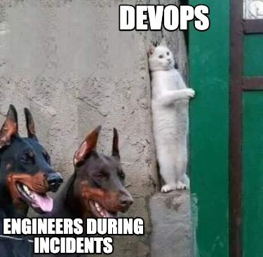

# I CAN'T ACCESS MY SERVER 

That's right, just as the title of this post says, I could not access my server. :lock: This problem lasted approximately 5 - 6 hours, from 10:00am, until 4:00pm, and yes, it was almost a full working day, basically if I was getting paid, I would be getting money for damaging things. :flushed: The impact in this case was not so drastic because the server did not contain relevant information and was only for my own use, it was being used for some tests, besides, I was working with a virtual server, so I can delete and create another one easily. :sweat_smile:, However, in case it was a production server, maybe hundreds of people's work in the company would have been lost. :scream: The root cause is that I was installing NGINX on a server and in the process, the firewall was being adjusted, in one of the commands indirectly port 22 got closed, with which access is granted from SSH. I did not realize that I closed this port, so I logged out of my server and could not log back in, since this method was the only one available for access. 
Time - The error was detected when I logged out of the server and tried to log back in via SSH, it was a matter of a few minutes. It was thought that maybe the server was developing a process that was taking a while to open, so we tried a soft and hard reboot, then noticing that this did not affect, it was thought that there were authentication problems with the keys and the values were confirmed with the backups. Seeing that this was not the problem, it occurred to me that maybe it was a problem with my machine, which was not establishing connections with servers due to internal problems, so I tried to access from another machine.
Additionally, I did some research, however, it is difficult to find the solution if I did not clearly know the problem and that when I tried to connect it did not throw an error, it just kept loading for a long time. :watch: I consulted the problem with higher areas that managed the servers and they told me that it is not possible to establish a connection with the server, but that I could talk to Amazon since they provide us with this service to see if they can access it. On the other hand, considering that it is a virtual server, we could also eliminate that server and use a new one. Considering the information and the relevance, it was decided to eliminate it and get a new one.
:tada:
To avoid this, you can check the status of the ports before exiting the server, to activate a port if necessary. To check if the port is active use the following command, in Linux:

`telnet myserver.com portnumber`

If the port is not open, you can open it before exiting in different ways depending on if there is a firewall, if a TCP connection is needed, among other aspects. 

